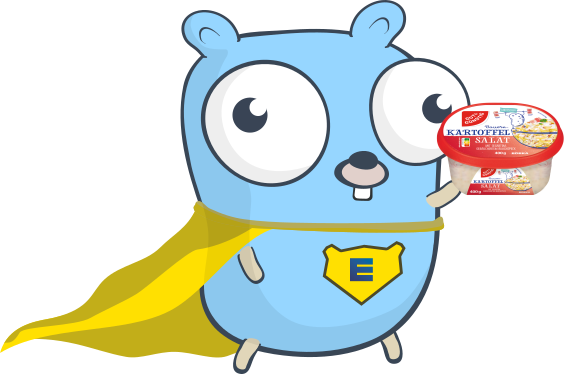

# [edekompile](https://github.com/ByteSizedMarius/edekompile)

<div>
  
  <p>
    Go client library for the Edeka, Marktkauf and Scheck-in mobile app API. Supports receipts, offers and market search.
  </p>
  <p>
    This repository contains the library (<a href="pkg">pkg</a>) and a simple CLI tool (<a href="cmd">cmd</a>) for demonstration purposes.
    A web ui is WIP.
  </p>
  <p>
    First-time setup requires a bearer token from a browser session at <a href="https://login.edeka/app">login.edeka/app</a>.
    I have a small CLI tool for obtaining a bearer available here: <a href="https://github.com/ByteSizedMarius/edekompile-auth-helper">ByteSizedMarius/edekompile-auth-helper</a>.
    The library uses this token to register a virtual device on the provided account and obtain API credentials.
    These credentials do not appear to expire (observed working for over a year), so the bearer is only needed once.
  </p>
</div>

> [!CAUTION]
> The credentials **may authorize in-store payments** on your Edeka account. Guard them like a bank card.
>
> - Never paste these tokens into websites, online forms, or third-party tools.
> - Read the source of any program you hand them to (including this one).
> - If you can't read and understand the source, don't use the tool.

## quick start

Use the library:

- Go: `go get github.com/ByteSizedMarius/edekompile/pkg` – [docs](https://pkg.go.dev/github.com/ByteSizedMarius/edekompile/pkg)

Or install the CLI:

- Download a [release](https://github.com/ByteSizedMarius/edekompile/releases)
- Or install via Go: `go install github.com/ByteSizedMarius/edekompile/cmd@latest`
- Or clone and build: `go build -o edekompile ./cmd`
- Verify: `edekompile --help`

Example: Fetch current offers for a market (no authentication required):

```
$ edekompile offers -market 4314021182307
Offers: 324
[...]
Kiwis Gold
  aus Italien, Klasse I, Stück
  Price: 0.79€
--------------------------------------
Gurken
  aus Spanien oder den Niederlanden, Klasse I, Stück
  Price: 0.55€
--------------------------------------
Trauben Mix
  hell und rot, kernlos, aus Südafrika oder Indien, Klasse I, 500 g, (1 kg = 3,98)
  Price: 1.99€
[...]
```

Receipts and market-search require authentication. You have two options:
1) Use [edekompile-auth-helper](https://github.com/ByteSizedMarius/edekompile-auth-helper) to generate the authentication file and copy it to the cli working directory, or 
2) Login at [login.edeka/app](https://login.edeka/app), copy the bearer from the browser devtools and then use the `login` command from the edekompile cli

## intro

The edeka app has gotten more attractive with the introduction of customer-facing scanners introduced during the launch of payback.
These scanners allow the participation in rewards programs, obtaining a digital receipt and paying with the scan of a single QR-code. 
However, digital receipts are only interesting if the data is freely accessible (which it isn't really in the app for any useful purposes), which is how this project came to be initially.

## contents

The [pkg](pkg) directory contains the core library. Implemented endpoints:

- **Authentication**: device registration, credential login, bearer-to-credentials exchange
- **Receipts**: list, details, pagination with iterator, parsed output
- **Market search**: find Edeka stores by city or zip code
- **Offers**: current weekly deals per market, offer images (REST/JSON, separate bearer auth)

The [cmd](cmd) directory contains a CLI tool that wraps all of the above.

## cli

```
Usage: edekompile.exe [flags] <command> [flags]

Flags:
  -auth <path>          Auth file path (default: edeka_auth.json in CWD)
  -token-id <id>        API token ID
  -token-secret <sec>   API token secret
  -json                 Output as JSON
  -timeout <duration>   Max time the command may run (e.g. 30s, 5m). No limit by default.
  -version              Print version and exit

Commands:
  login           Exchange a manually retrieved bearer token for API credentials (first-time setup)
                  A small CLI tool for obtaining a bearer: https://github.com/ByteSizedMarius/edeka-auth-helper
  receipts        List and get receipt details (requires auth)
  markets         Search for Edeka stores (requires auth)
  offers          Get current offers for a market (no auth needed)

Examples:
  edekompile.exe login -bearer <token>
  edekompile.exe receipts list
  edekompile.exe receipts get -id 12345
  edekompile.exe markets search -query Berlin -limit 5
  edekompile.exe offers -market <gln>    # use the GLN from 'markets search' output

Run 'edekompile.exe <command>' for subcommand help.
```

## disclaimer

This project is not affiliated with, endorsed by, or sponsored by EDEKA ZENTRALE Stiftung & Co. KG. "Edeka" is a registered trademark of its respective owner.

This is an unofficial client based on publicly observable network traffic from the Edeka mobile app. It is provided for educational and research purposes. The underlying API is undocumented and may change or break at any time without notice.

Use of this software is at your own risk. Users are responsible for ensuring their usage complies with applicable terms of service.

## misc

The internal authentication is strange. See [auth/readme.md](./auth/readme.md) and [auth/architecture.md](./auth/architecture.md).

A Python wrapper (via FFI, similar to [rewerse-engineering](https://github.com/ByteSizedMarius/rewerse-engineering)) is planned if there's enough interest (~25 stars).

Feel free to open github issues for suggestions, questions, bugs. PRs welcome. Email: edeka at byte dot rest

## attribution

https://github.com/egonelbre/gophers